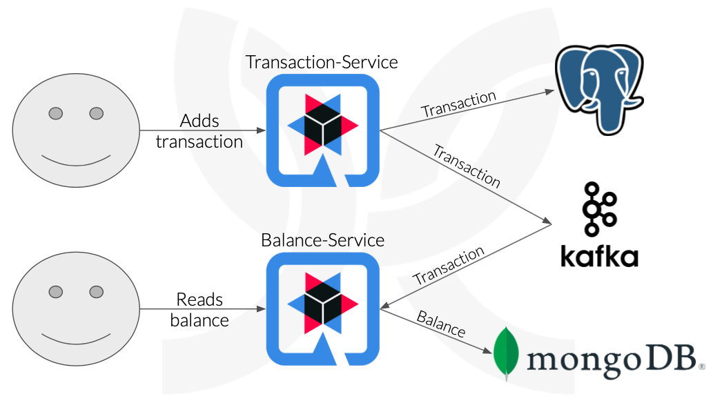

## Quarkus, Kafka e deploy

### Criando um sistema de orçamento, utilizando CQRS, Quarkus, Kafka e deploy

Este projeto foi feito baseado nas aulas da Digital Innovation One e pode ser encontrado [aqui](https://github.com/wesleyfuchter/cqrs-quarkus-kafka).

**Descrição do projeto**

Neste Labs vamos implantar uma aplicação escrita em Java/Kotlin no serviço Elastic **Kubernetes** Service da Amazon. A aplicação é um exemplo do padrão CQRS que contempla dois serviços **Quarkus** que se comunicam através de um barramento assíncrono usando o **Kafka**. Você vai aprender a criar os manifestos do Kubernetes para implantação no EKS e quais configurações são necessárias para ter o ambiente rodando em produção.

> **Obs.**: Este projeto foi apenas replicado seguindo as aulas, não há nenhuma alteração extra.

A aplicação simula um cenário de conta bancária, em que um usuário final adiciona uma transação de receita ou despesa e é processado em uma fonte de eventos assíncrona e arquitetura CQRS para recalcular o saldo da conta bancária do usuário. O usuário também pode solicitar o saldo de sua conta. Na imagem há a arquitetura do projeto:

<kbd>
  
</kbd>

### :computer: Rodar a aplicação
---

TODO :hammer_and_wrench:
